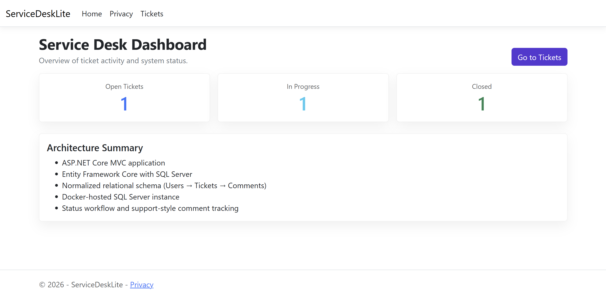
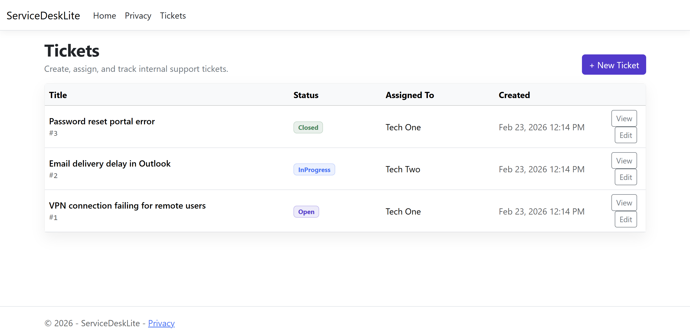
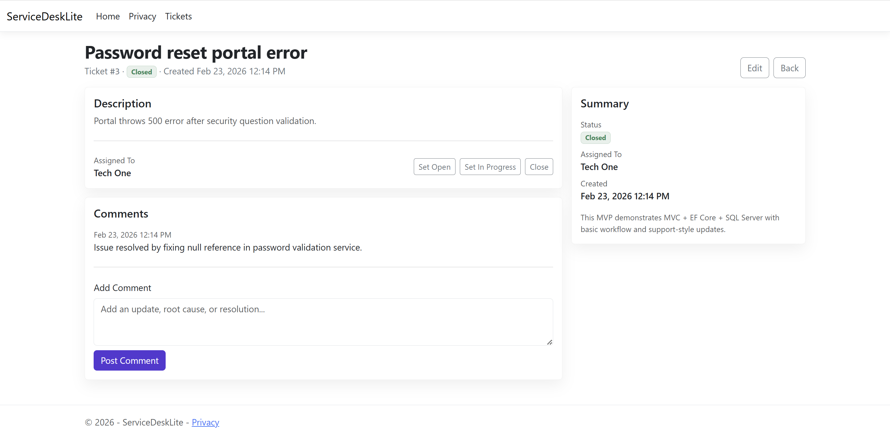
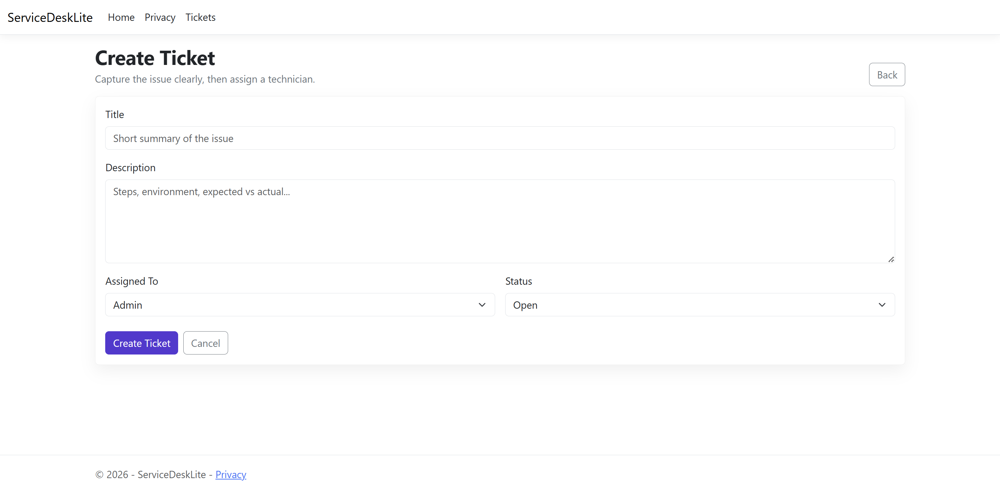

# Service Desk Lite

ASP.NET Core MVC ticket management system demonstrating C#, Entity Framework Core, SQL Server, and IIS deployment.

## Why this project
This project is built as an interview-ready MVP to demonstrate:
- ASP.NET Core MVC fundamentals
- Entity Framework Core with SQL Server
- Relational schema design and normalization
- Git workflow and documentation discipline
- IIS hosting readiness (publish + deploy)

## Tech Stack
- **Backend:** ASP.NET Core MVC (C#)
- **Data:** Entity Framework Core, SQL Server
- **Hosting:** IIS (local), cloud-ready configuration
- **Tooling:** Git, GitHub

## Planned MVP Features
- Ticket CRUD: Create, List, Details, Edit, Close
- Technician assignment (simple)
- Status workflow: Open → In Progress → Closed
- Database-backed persistence with migrations
- Basic validation and error handling

## Getting Started

### 1) Start SQL Server (Docker)
```bash
docker rm -f sdl-sqlserver 2>/dev/null || true

docker run \
  -e "ACCEPT_EULA=Y" \
  -e "MSSQL_SA_PASSWORD=Str0ngPassw0rd" \
  -p 1433:1433 \
  --name sdl-sqlserver \
  -d mcr.microsoft.com/mssql/server:2022-latest
```

## Screenshots

### Dashboard


### Tickets List


### Ticket Details


### Create Ticket

>>>>>>> f701bc1 (docs: added screenshots and updated README.md)

## Repository Structure (TODO)
- `/src` Application source
- `/docs` Architecture notes and diagrams
